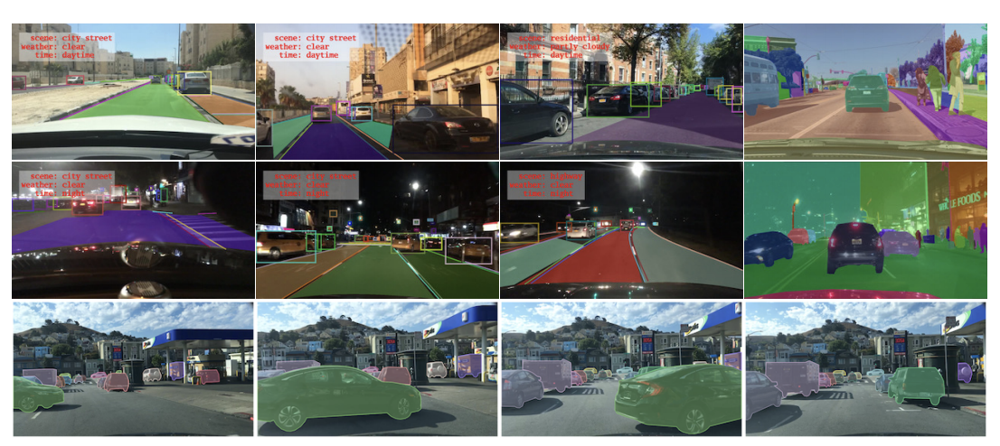
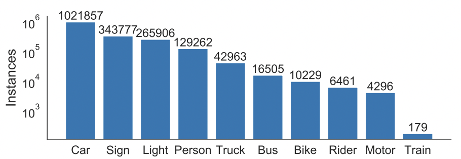

# 车流量统计


## 1 项目说明

目标跟踪任务的定义是给定视频流，对多个感兴趣的目标进行同时定位，并且维护个体的ID信息并记录它们的轨迹。

目标跟踪和目标检测任务都能够输出检测信息。对于目标检测，输出一段视频流，输出目标的类别和位置信息，但是视频帧之间没有关联信息，因为目标检测无法对帧与帧进行建模。目标跟踪模型增加了一个目标个体的ID信息，利用目标跟踪模型可以构建出帧与帧之间的联系。两个任务之间的差异点在于目标跟踪需要持续追踪目标运动状态，目标检测只需要检测出目标在某个瞬间的状态即可。

目标跟踪的应用场景有流水线上零件计数、车辆行人计数与轨迹跟踪、医学分析等。

本案例是智慧交通的AI应用-车辆计数与轨迹跟踪，单镜头多车辆追踪计数。

本项目采用MOTA评估模型精度，采用FPS评估模型的速度。

MOTA（跟踪准确率），除了误报、丢失目标、ID异常切换情况以外的正确预测样本占所有样本的比率，衡量了跟踪器在检测目标和保持轨迹时的性能，与目标位置的估计精度无关。

<center></center>

$$m_t$$:FP,缺失数（漏检数），即在第t帧中该目标$$O_j$$没有假设位置与其匹配。

$$fp_t$$:是FN，误判数，即在第t帧中给出的假设位置$$h_j$$没有跟踪目标与其匹配。

$$mme_t$$:是ID Sw，误配数，即在第t帧中跟踪目标发生ID切换的次数，多发生在这档情况下。

## 2 数据准备

本案例利用公开数据集BDD100K，该数据集由伯克利大学AI实验室（BAIR）于2018年5月发布。BDD100K 数据集包含10万段高清视频，每个视频约40秒，720p，30 fps。每个视频的第10秒对关键帧进行采样，得到10万张图片（图片尺寸：1280*720 ），并进行标注。

<center></center>

BDD100K数据集标注如下：

* 道路目标边界框：10万张图片。其中：训练集7万，测试集2万，验证集1万
* 可行驶区域：10万张图片
* 车道线标记：10万张图片
* 全帧实例分割：1万张图片

Annotation包含了被标记对象的： 源图像的URL、类别标签、大小（起始坐标、结束坐标、宽度和高度）、截断、遮挡和交通灯颜色等信息。

数据集中的GT框标签共有10个类别，分别为：Bus、Light、Sign、Person、Bike、Truck、Motor、Car、Train、Rider。总共约有184万个标定框，不同类型目标的数目统计如下图所示：

<center></center>

其中汽车（Car）一类超过了100万个样本。

BDD100K数据集采集自6中不同的天气，其中晴天样本较多；采集的场景有6种，以城市街道为主；采集的时间有3个阶段，其中白天和夜晚居多。

本案例数据处理脚本请参考：https://github.com/PaddlePaddle/PaddleDetection/tree/develop/configs/mot/vehicle/tools/bdd100kmot。

## 3 模型选择

当前主流的多目标追踪(MOT)算法主要由两部分组成：Detection+Embedding。Detection部分即针对视频，检测出每一帧中的潜在目标。Embedding部分则将检出的目标分配和更新到已有的对应轨迹上(即ReID重识别任务)。根据这两部分实现的不同，又可以划分为SDE系列和JDE系列算法。

SDE(Separate Detection and Embedding)这类算法完全分离Detection和Embedding两个环节，最具代表性的就是DeepSORT算法。这样的设计可以使系统无差别的适配各类检测器，可以针对两个部分分别调优，但由于流程上是串联的导致速度慢耗时较长，在构建实时MOT系统中面临较大挑战。

JDE(Joint Detection and Embedding)这类算法完是在一个共享神经网络中同时学习Detection和Embedding，使用一个多任务学习的思路设置损失函数。代表性的算法有JDE和FairMOT。这样的设计兼顾精度和速度，可以实现高精度的实时多目标跟踪。

### 3.1 DeepSort

[DeepSORT](https://arxiv.org/abs/1812.00442)(Deep Cosine Metric Learning SORT) 扩展了原有的[SORT](https://arxiv.org/abs/1703.07402)(Simple Online and Realtime Tracking)算法，增加了一个CNN模型用于在检测器限定的人体部分图像中提取特征，在深度外观描述的基础上整合外观信息，将检出的目标分配和更新到已有的对应轨迹上即进行一个ReID重识别任务。DeepSORT所需的检测框可以由任意一个检测器来生成，然后读入保存的检测结果和视频图片即可进行跟踪预测。

### 3.2 JDE

[JDE](https://arxiv.org/abs/1909.12605)(Joint Detection and Embedding)是在一个单一的共享神经网络中同时学习目标检测任务和embedding任务，并同时输出检测结果和对应的外观embedding匹配的算法。JDE原论文是基于Anchor Base的YOLOv3检测器新增加一个ReID分支学习embedding，训练过程被构建为一个多任务联合学习问题，兼顾精度和速度。

### 3.3 FairMOT
anchor-based的检测框架中存在anchor和特征的不对齐问题，所以这方面不如anchor-free框架。[FairMOT](https://arxiv.org/abs/2004.01888)方法检测选用了anchor-free的CenterNet算法，克服了Anchor-Based的检测框架中anchor和特征不对齐问题，深浅层特征融合使得检测和ReID任务各自获得所需要的特征，并且使用低维度ReID特征，提出了一种由两个同质分支组成的简单baseline来预测像素级目标得分和ReID特征，实现了两个任务之间的公平性，并获得了更高水平的实时多目标跟踪精度。

FairMOT属于JDE（Jointly learns the Detector and Embedding model ）的一种。实验证明了现有的JDE方法存在一些不足，FairMOT根据这些不足进行了相关的改进。

综合速度和精度，本案例选用FairMot模型实现车辆跟踪计数。

## 4 模型训练

运行如下代码开始训练模型：
'python3.7 -m paddle.distributed.launch --log_dir log_vehicle --gpus 0,1,2,3,4,5,6,7 tools/train.py   -c configs/mot/vehicle/fairmot_dla34_30e_1088x608_bdd100k_vehicle.yml' 

断点接着训练添加：'-r output/fairmot_dla34_30e_1088x608_bdd100k_vehicle/4'

## 5 模型评估

运行如下代码：
```
python3.7 tools/eval_mot.py -c configs/mot/vehicle/fairmot_dla34_30e_1088x608_bdd100k_vehicle.yml -o weights=models/fairmot_dla34_30e_1088x608_bdd100k_vehicle.pdparams
```

## 6 模型优化

具体见[模型优化文档](./accuracy_improvement.md)

## 7 模型预测

视频预测：
```
python3.7 tools/infer_mot.py -c configs/mot/vehicle/fairmot_dla34_30e_1088x608_bdd100k_vehicle.yml -o weights=models/fairmot_dla34_30e_1088x608_bdd100k_vehicle.pdparams --video_file=dataset/mot/test_vehicle.mov  --save_videos --draw_threshold 0.4
```

## 8 模型导出

导出模型运行如下代码：
```
python3.7 tools/export_model.py -c configs/mot/vehicle/fairmot_dla34_30e_1088x608_bdd100k_vehicle.yml  -o weights=models/fairmot_dla34_30e_1088x608_bdd100k_vehicle.pdparams
```

## 9 用导出的模型基于Python去预测

运行如下代码：

```
python3.7 deploy/python/mot_jde_infer.py --model_dir=output_inference/fairmot_dla34_30e_1088x608_bdd100k_vehicle --video_file=dataset/mot/test_model.mov --device=GPU --run_benchmark=True --trt_max_shape=1088 --trt_min_shape=608 --trt_opt_shape=608 --run_mode=trt_fp16   --save_mot_txts
```

